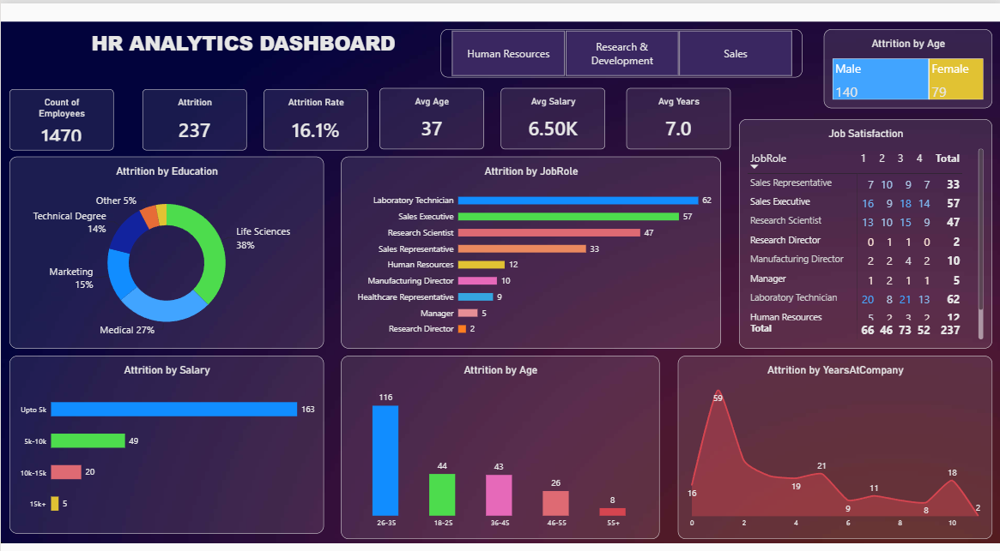

# 📊 HR Analytics Dashboard – Power BI

An interactive **HR Analytics Dashboard built using Microsoft Power BI** to analyze employee demographics, attrition, salary, job roles, job satisfaction, and employee tenure.

The dashboard helps HR teams and business users explore workforce trends and identify patterns related to employee attrition.

---

## 📌 Dashboard Overview

The **HR Analytics Dashboard** provides an interactive view of employee data and key HR metrics.

### Key KPIs

- 👥 **Employee Count**
- 📉 **Attrition Count**
- 📊 **Attrition Rate**
- 💰 **Average Monthly Income**
- 🎂 **Average Age**
- 🏢 **Average Years at Company**

### Visualizations

The dashboard includes:

- Attrition by **Education Field**
- Attrition by **Job Role**
- Attrition by **Gender**
- Attrition by **Salary Slab**
- Attrition by **Age Group**
- Attrition by **Years at Company**
- Job Satisfaction by **Job Role**
- Interactive filtering by **Department**

---

## 🖼️ Dashboard Preview

> Add an exported screenshot of your Power BI dashboard here.

```text
📁 assets/
   └── hr-analytics-dashboard.png
```

After adding the image, replace the section above with:

```markdown

```

---

## 🛠️ Tools & Technologies

- **Microsoft Power BI**
- **Power Query** – Data cleaning and transformation
- **DAX** – Measures and calculated metrics
- **Data Visualization**
- **Data Analysis**

---

## 📂 Project Structure

```text
HR-Analytics-PowerBI/
│
├── HR Analytics Dashboard.pbix
├── README.md
│
└── assets/
    └── hr-analytics-dashboard.png
```

---

## 📊 Dashboard Features

### 1. Employee Overview
Provides high-level KPIs such as total employees, attrition count, attrition rate, average age, average income, and average years at the company.

### 2. Attrition Analysis
Analyzes employee attrition across:

- Education fields
- Job roles
- Gender
- Salary slabs
- Age groups
- Years at the company

### 3. Job Satisfaction Analysis
Shows the distribution of employee satisfaction across different job roles.

### 4. Department Filter
Users can select a department to dynamically filter the dashboard and explore department-specific HR metrics.

---

## 🔍 Insights This Dashboard Can Help Explore

The dashboard can be used to investigate questions such as:

- Which job roles have higher employee attrition?
- How does attrition vary across salary slabs?
- Which age groups show higher attrition?
- How does employee attrition differ by gender?
- Is attrition related to years spent at the company?
- How does job satisfaction vary across job roles?
- How do HR metrics change between departments?

---

## ▶️ How to Open the Dashboard

1. Install **Microsoft Power BI Desktop**.
2. Download or clone this repository.
3. Open:

```text
HR Analytics Dashboard.pbix
```

4. If Power BI asks for data-source access or refresh permissions, configure the required source settings.
5. Use the dashboard filters and visuals to explore the analysis.

> **Note:** GitHub can store the `.pbix` file, but it does not render Power BI dashboards directly in the browser. Users normally download the PBIX file and open it using Power BI Desktop.

---

## 🚀 How to Upload This Project to GitHub

### Option 1 – GitHub Website

1. Create a new repository on GitHub.
2. Give it a name such as:

```text
HR-Analytics-PowerBI
```

3. Set the repository to **Public** if you want to showcase it in your resume/portfolio.
4. Click **Add file → Upload files**.
5. Upload:

```text
HR Analytics Dashboard.pbix
README.md
```

6. Create an `assets` folder and upload your dashboard screenshot:

```text
assets/hr-analytics-dashboard.png
```

7. Click **Commit changes**.

Your repository will look like:

```text
HR-Analytics-PowerBI
│
├── HR Analytics Dashboard.pbix
├── README.md
└── assets/
    └── hr-analytics-dashboard.png
```

---

### Option 2 – Upload Using Git

Open PowerShell in your project folder:

```powershell
cd "C:\path\to\HR-Analytics-PowerBI"
```

Initialize Git:

```powershell
git init
```

Add the files:

```powershell
git add .
```

Create the first commit:

```powershell
git commit -m "Add HR Analytics Power BI Dashboard"
```

Connect your GitHub repository:

```powershell
git branch -M main
git remote add origin https://github.com/YOUR-USERNAME/HR-Analytics-PowerBI.git
```

Push the project:

```powershell
git push -u origin main
```

Replace `YOUR-USERNAME` with your GitHub username.

---

## 📈 Portfolio / Resume Description

You can describe this project on your resume as:

- Developed an interactive **HR Analytics Dashboard using Power BI** to analyze employee attrition, demographics, salary, job roles, and job satisfaction.
- Created **DAX-based KPIs and interactive visualizations** with department-level filtering to support workforce analysis.
- Performed data transformation and visualization using **Power Query and Power BI** to identify HR trends and employee attrition patterns.

---

## 👨‍💻 Author

**Abhishek Kumar Yadav**

If you found this project useful, feel free to ⭐ the repository.

---

## 📄 License

This project is intended for educational and portfolio purposes.
